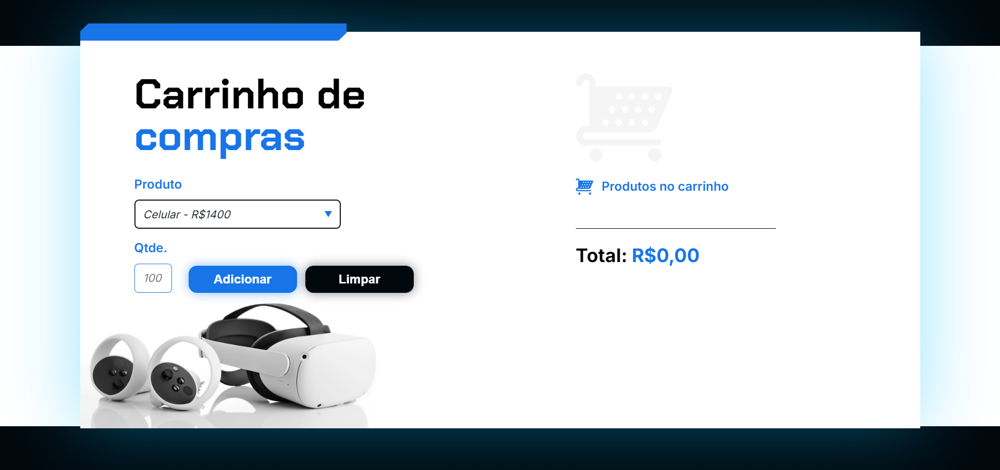

# 🛒 Carrinho de Compras

## Descrição

Bem-vindo ao **Carrinho de Compras**!  
Este é um Carrinho de compras desenvolvido usando JavaScript, HTML, e CSS. Com foco no javascript

## Teste agora!

Você pode testar a versão diretamente no seu navegador:

[**Clique aqui para jogar!**](https://carrinho-de-compras-beta-gilt.vercel.app/)

## Projeto de Estudo

Este jogo foi desenvolvido como parte dos estudos na plataforma **Alura**..  
A Alura oferece uma ampla gama de cursos focados em desenvolvimento, e foi fundamental para a construção desse projeto, que tem como objetivo aplicar conceitos práticos de JAVASCRIPT.

## Contribuições

Contribuições são bem-vindas!  
Se você quiser reportar um bug, sugerir uma funcionalidade ou enviar um PR, fique à vontade. 
